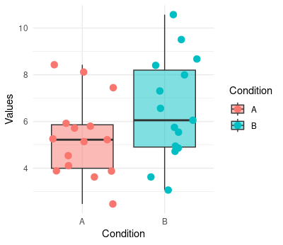
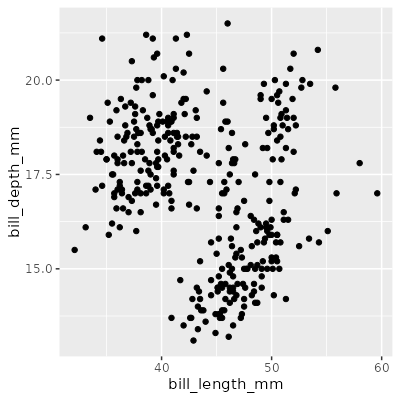
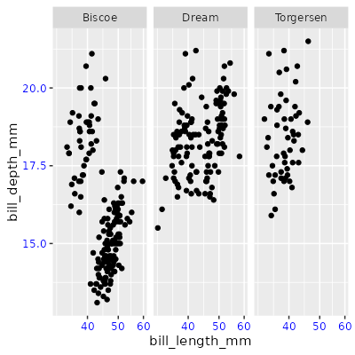
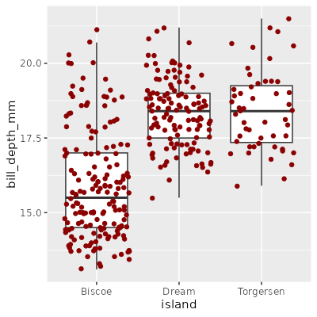
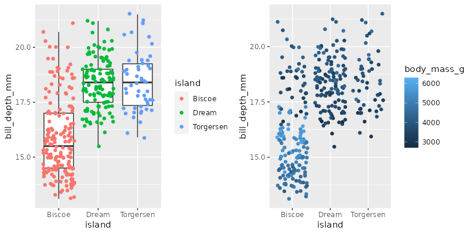

# Manual ggplot2

## Importancia de la visualización de datos

Por regla general es muy complicado analizar un tabla de datos a partir de los valores de la misma, sean numéricos o carácteres.  Por este motivo es muy importante conocer y saber aplicar las diferentes técnicas de visualización de datos. A continuación se muestra un ejemplo de un conjunto pequeño de datos y la visualización de los mismos.

Valores de una variable numérica distribuidos entre 30 muestras de dos condiciones diferentes en formato tabla:

| Condition | Values |  Condition | Values |
| -------- | ------- | -------- | ------- |
| A |  3.879049 | B | 10.573826 |
| A |  4.539645 | B |  7.995701 |
| A |  8.1174174 | B |  3.066766 |
| A |  5.141017 | B |  8.402712 |
| A |  5.258575 | B |  6.054417 |
| A |  8.430130 | B |  4.864353 |
| A |  5.921832 | B |  6.564050 |
| A |  2.469878 | B |  4.947991 |
| A |  3.626294 | B |  5.542218 |
| A |  4.108676 | B |  5.749921 |
| A |  7.448164 | B |  3.626613 |
| A |  5.719628 | B |  8.675574 |
| A |  5.801543 | B |  7.306746 |
| A |  5.221365 | B |  4.723726 |
| A |  3.888318 | B |  9.507630 |

Y mediante la visualización de dichos datos



A simple vista, a partir de los datos de la tabla es muy complicado sacar ninguna conclusión de los mismos, sin embargo, mediante el uso de visualizaciones sencillas podemos interpretar de forma mucho más eficiente los datos de los que disponemos.

## ¿Cómo hacer un gráfico con ggplot2?

`ggplot2` es una librería de R que se engloba dentro de un conjunto de paquetes llamado `tidyverse`, que incluye algunas librerías muy útiles para la manipulación de datos como `dplyr` o `stringr`. Aunque en R hay numerosas formas de diseñar gráficos, `ggplot2` es quizá la más utilizada ya que es fácil de aprender y permite un elevado grado de personalización. Se basa en una sintaxis conocida como gramática de gráficos (grammar of graphics) mediante la cual, con solo conocer una serie de funciones podemos generar miles de gráficos diferentes. Además, `ggplot2` resulta sencillo ya que se trata de componer la figura mediante bloques. Por el contrario presenta una gran desventaja y es que el formato de entrada de los datos es muy estático, conocido como datos `tidy` y que consiste en tablas en las que cada registro se almacena en una fila de la tabla. Por lo general, los datos que se recogen suelen ser de este estilo salvo que nos encontremos con matrices, las cuales deben ser transformadas a formato `tidy`.

Antes de comenzar a generar gráficos, debemos tener en cuenta un aspecto específico de los gráficos de `ggplot2` y es que están construidos a base de capas. Para generar un gráfico es necesario utilizar al menos 3 capas:

- Datos. La tabla con los datos que vamos a visualizar, siempre en formato tidy.
- Objeto geométrico. La representación en la que vamos a visualizar los datos (puntos, boxplot, líneas, texto, etc)
- Estética: La forma en la que vamos a visualizar los datos (coordenadas x e y, etiquetas, colores etc.)

El resto de capas, que son las que nos permiten hacer de nuestro gráfico algo personal las iremos viendo a lo largo de este tutorial. Algunas de ellas son: escala, etiquetas, legenda, tema o paneles.

Ahora si, vamos a comenzar a generar nuestros primeros gráficos. Para ello usaremos 3 funciones fundamentales. La primera de ellas es `ggplot()` que se utiliza para indicar que se va a crear un objeto de R de tipo ggplot. Esta función se utiliza, generalmente para cargar los datos y definir la estética. Esta estética se determina con la función `aes()`. Finalmente usaremos una función para el objeto geométrico. Todas ellas siguen la misma gramática `geom_X()`, de este modo tenemos `geom_point()` para puntos, `geom_line()` para líneas o `geom_text()` para texto. A lo largo del tutorial veremos muchísimas.

```r
library(tidyverse)
library(palmerpenguins) # This library contains collected data from penguin population

p <- ggplot(data = penguins)
print(p) # Genera una figura vacía
class(p) # [1] "gg"     "ggplot"

p <- ggplot(data = penguins, aes(x = bill_length_mm, y = bill_depth_mm)) # Genera figura con ejes x e y pero vacía
print(p)

p <- ggplot(data = penguins, aes(x = bill_length_mm, y = bill_depth_mm)) + # Usamos el símbolo + para añadir componentes
  geom_point() # Al introducir el objeto geométrico, genera el scatter plot
print(p)

p <- ggplot(data = penguins, aes(x = bill_length_mm, y = bill_depth_mm))
p <- p + geom_point() # También podemos añadir componentes a una variable de clase ggplot

# Usamos print(p) o simplemente p para visualizar el gráfico
print(p)
p
```



## Personalizar un gráfico en ggplot2

En este apartado abordaremos las principales características de la visualización de datos con `ggplot2`. Para ello, se ha elaborado una serie de secciones en las que se trata de dar relevancia a cada una de ellas. Estas secciones son: cómo añadir y modificar capas, los principales objetos geométricos, escalas y colores, paneles múltiples y estilos.

### Añadir y modificar capas

Como hemos comentado, en `ggplot2` creamos los gráficos a partir de ir añadiendo capas. Cada capa o componente puede definir elementos muy diferentes: geometrías, estadística, escalas o estilos. Un ejemplo típico de comando de `ggplot2` sería este:

```r
library(tidyverse)
library(palmerpenguins)

p <- penguins %>% ggplot() + # Otra forma de introducir los datos
  geom_point(aes(x = bill_length_mm, y = bill_depth_mm)) + # Capa del objeto geométrico, indicando la capa estética
  scale_x_continuous(trans = "log10") + # capa escala para modificar la escala del eje x
  theme(axis.text = element_text(color = "blue")) + # capa estilo para modificar el color del texto de los ejes
  facet_wrap(~island) # capa multipanel

p
```



También es posible concatenar varios objetos geométricos en una misma figura, por ejemplo, vamos a hacer un boxplot sobre el cual vamos a poner los puntos. No te preocupes si hay algo que no entiendas, en el siguiente apartado veremos las principales opciones de los objetos geométricos más usados.

```r
p <- penguins %>% ggplot() + 
  geom_boxplot(aes(x = island, y = bill_depth_mm), outlier.shape = NA) + # usamos geom_boxplot para visualizar el boxplot
  geom_jitter(aes(x = island, y = bill_depth_mm), color = "darkred") # A continuación se introducen los puntos coloreados de rojo (el orden es importante)

p
```


En la figura anterior hemos visto como colorear los puntos de un color determinado. Sin embargo, en ocasiones nos interesará colorearlos en base a alguna variable de nuestra tabla. Para ello debemos introducir el nombre de dicha variable asignándola al parámetro color, pero dentro de la estética, es decir, en la función `aes()`. La variable que se puede asignar a un color (o forma, tamaño) puede ser categórica (factor o carácter) o numérica. Vemos un ejemplo de cada una de ellas.

```r
p <- penguins %>% ggplot() + 
  geom_boxplot(aes(x = island, y = bill_depth_mm), outlier.shape = NA) +
  geom_jitter(aes(x = island, y = bill_depth_mm, color = island)) # introducimos color en la función aes() y la asignamos a variable categórica

p

p1 <- penguins %>% ggplot() + 
  geom_jitter(aes(x = island, y = bill_depth_mm, color = body_mass_g)) # introducimos color en la función aes() y la asignamos a variable numérica

p1
```


### Principales objetos geométricos
